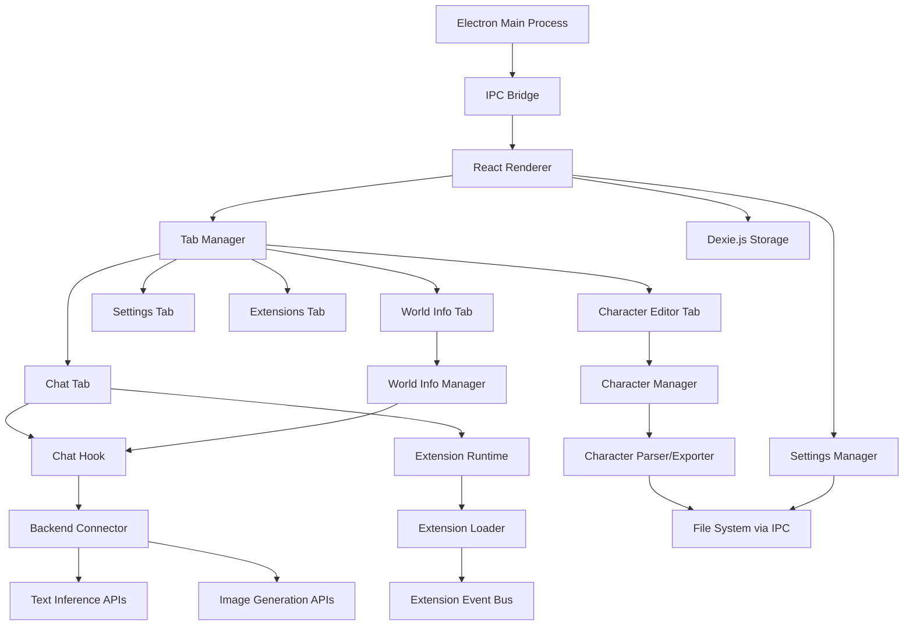
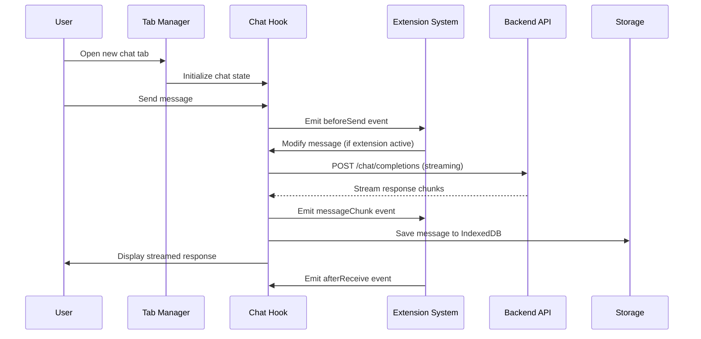

# ROADMAP - EasyTavern

## Observations

The codebase is a modern React + TypeScript application using Vite, shadcn/ui components, and Tailwind CSS. It has basic chat functionality with OpenAI-compatible API support, character management, and settings persistence via localStorage. The current implementation is web-based only (no Electron), uses a single-page layout, lacks streaming support, and has no extension system. The architecture follows React best practices with custom hooks (`useChat`, `useSettings`) and component-based structure.

## Approach

The implementation will transform EasyTavern into a feature-rich, tab-based desktop application compatible with SillyTavern extensions. The approach prioritizes: 
(1) Electron integration for desktop deployment, 
(2) tab-based architecture to declutter the main interface, 
(3) Compatible with all SillyTavern extensions, 
(4) enhance backend connectivity with streaming support, 
(5) modular extension system,
(6) Add Aceternity and Framer Motion for elegant backgrounds. 

## Implementation Plan

### 1. Electron Desktop Application Setup

**Add Electron dependencies and configuration:**
- Install `electron`, `electron-builder`, `concurrently` as dev dependencies
- Create `file:electron/main.ts` for Electron main process with window management, IPC handlers, and menu setup
- Create `file:electron/preload.ts` for secure context bridge exposing IPC to renderer
- Update `file:package.json` scripts to include `electron:dev`, `electron:build` for development and production builds
- Configure `file:electron-builder.json` for packaging (Windows, macOS, Linux targets)
- Modify `file:vite.config.ts` to support Electron renderer process (adjust base path, output directory)
- Add Node.js polyfills for Electron environment compatibility

**File system access layer:**
- Create `file:src/lib/electron-api.ts` wrapper for IPC communication (file read/write, dialog operations)
- Implement file-based storage in `file:src/hooks/useSettings.ts` to use Electron's app data directory instead of localStorage for app portability

### 2. Tab-Based Interface Architecture

**Core tab management system:**
- Create `file:src/types/tabs.ts` defining `Tab`, `tabType` (chat, character-editor, settings, extensions, world-info), and `tabManager` interfaces. This menu is normally hidden above the top of the screen, only revealing itself by mouse-proximity to a 'North Star' icon; a blue-white dot at the top, center of the background
- Create `file:src/hooks/useTabManager.ts` for tab state management (create, close, switch, reorder tabs) with persistence
- Create `file:src/components/tabs/tabBar.tsx` component with draggable tabs, close buttons, and new tab dropdown
- Create `file:src/components/tabs/tabContent.tsx` router component that renders appropriate content based on active tab type

**Refactor main layout:**
- Stack:
  - Framework: Next.js
  - Styles: TailwindCSS v4
  - Component Library: shadcn/ui & GlassUI
  - Backgrounds from AceternityUI (user selectable (Vortex / Aurora / Gradient Ani ) or static)
  - UI Animations: Framer Motion
  
- Tabbed menu will be hidden behind either GlassUI's drawer that will pull down from the top OR AceternityUI's 'floating-navbar'
- Dialog column will be on a variable transparency GlassUI object.
- This will be a portable app and all config files should be externalized to the executable directory for easy customization (with defaults hardcoded incase something goes wrong)

**To this end:**
- Install necessary dependencies (Next,js, GlassUI, Aceterity, Framer Motion)
- Update `file:src/pages/Index.tsx` to use tab-based layout instead of single-page
- Move current chat interface to `file:src/components/tabs/Chat.tsx` as a tab content component
- Create `file:src/components/tabs/Settings.tsx` by extracting settings panel into dedicated tab
- Create `file:src/components/tabs/Extensions.tsx`v3 that will--like Silly Tavern--present a list of installed extensions who settings are behind an accordian.
- Implement tab context provider in `file:src/contexts/TabContext.tsx` for global tab state access

**Tab persistence:**
- Extend `file:src/hooks/useSettings.ts` to save/restore tab state (open tabs, active tab, tab-specific data)
- Implement session recovery on app restart

### 3. SillyTavern Character Card Compatibility

**Character card format support:**
- Character Card standards are defined here: `F:/git/easytavern/src/components/chara/` in `chara-card-v2` and `v3.js`
- Create `file:src/types/character-card.ts` defining both Character Card V2 and V3 specs, with V3 as the native internal format
  - V2 spec: name, description, personality, scenario, first_mes, mes_example, creator_notes, system_prompt, post_history_instructions, alternate_greetings, character_book, tags, creator, character_version, extensions
  - V3 spec: superset of V2 with additional fields (assets, nickname, creator_notes_multilingual, ccv3 metadata)
- Reuse the Character file handling logic from here: https://github.com/aleph23/tavern-card-crafter-v3/blob/prime/src/pages/Index.tsx
- Create `file:src/lib/character-parser.ts` for parsing character cards from multiple formats:
  - PNG/APNG files: extract tEXt chunk named "ccv3" (V3) or "Chara" EXIF metadata (V2)
  - JSON files: parse as V2 or V3 format
  - CHARX files: unzip and read card.json with asset extraction (This is VERY low priority. There are few charX's in the wild)
- Create `file:src/lib/character-exporter.ts` for exporting characters in V3 format to PNG/APNG with tEXt chunk embedding, JSON, (or CHARX-low priority)
- Integrate tavern-card-crafter-v3 as a dependency in `file:package.json` for reusing PNG/JSON read/write logic from https://github.com/aleph23/tavern-card-crafter-v3 and to let this editor act as the in-app character editor
- Create `file:src/lib/character-upsample.ts` for converting V2 cards to V3 format (map V2 fields to V3, populate new V3 fields with defaults)

**Enhanced character management:**
- Update `file:src/types/chat.ts` Character interface to use V3 spec as native format
- Utilize aleph23/tavern-card-crafter-v3 as the internal character editor.
- Create `file:src/components/character/CharacterImport.tsx` dialog for importing from file/URL with automatic V2-to-V3 upsampling
- Update `file:src/components/layout/Sidebar.tsx` to display character avatars from PNG files (extract from card metadata) of only thoose characters present in the ongoing chat.
- Implement character library in `file:src/hooks/useCharacters.ts` with CRUD operations, file system integration, and V2/V3 format detection
- Leverage tavern-card-crafter-v3 utilities for PNG metadata extraction and JSON serialization to ensure compatibility

**World Info/Lorebook system:**
- Create `file:src/types/world-info.ts` for lorebook entries (keys, content, insertion order, enabled state). This should track not only the 'whole world' lorebooks, but also the individual character's embedded lorebooks as they behave by the same trigger logic and are placed at the same depth in the prompt.
- Create `file:src/components/world-info/WorldInfoEditor.tsx` tab for managing lorebook entries
- Implement lorebook injection logic in `file:src/hooks/useChat.ts` prompt builder (scan for keywords, insert at appropriate positions)

### 4. Backend Connectivity Enhancement

**Streaming response support:**
- Use WebLLM for the chat interface, The interface screen should have a small rolodex of interchangeable system prompts and API model presets that can be easily called without having to change pages
- Update `file:src/hooks/useChat.ts` sendMessage to support Server-Sent Events (SSE) for streaming
- Implement streaming parser for OpenAI-compatible endpoints (handle `data: [DONE]`, parse JSON chunks)
- Add streaming UI feedback in `file:src/components/chat/ChatMessage.tsx` (typing indicator, partial message rendering)
- Create `file:src/lib/streaming.ts` utility for handling different streaming formats (OpenAI, Anthropic, Ollama)
- All button should be Icon-only (Lucide?) with a text-based tooltip.

**Image generation integration:**
- Create `file:src/types/image-generation.ts` for image provider configs (Stable Diffusion, DALL-E, NovelAI, etc.)
- Create `file:src/hooks/useImageGeneration.ts` for image API calls with provider abstraction
- Create `file:src/components/image/ImageGenerationPanel.tsx` for prompt input, settings, and gallery
- Add image message type to `file:src/types/chat.ts` and rendering in `file:src/components/chat/ChatMessage.tsx`
- Implement image embedding in chat context for multimodal models
- Explore integrating StableDiffusion.cpp at some point.

**Advanced API features:**
- Add stopping strings support in `file:src/hooks/useChat.ts` (custom token sequences to halt generation)
- Implement token counting in `file:src/lib/tokenizer.ts` using tiktoken or approximation
- Add context management (sliding window, summarization) in `file:src/lib/context-manager.ts`
- Create `file:src/components/settings/PromptTemplates.tsx` for managing reusable prompt formats

### 5. Extension System Architecture

**Extension loader and runtime:**
- Create `file:src/types/extension.ts` defining extension manifest schema (name, version, author, entry point, permissions, hooks)
- Create `file:src/lib/extension-loader.ts` for discovering extensions in `extensions/` directory, validating manifests, and loading scripts
- Create `file:src/lib/extension-runtime.ts` providing sandboxed execution context with limited API access
- Implement extension event bus in `file:src/lib/extension-events.ts` (message sent/received, character loaded, settings changed, etc.)

**Extension API surface:**
- Create `file:src/lib/extension-api.ts` exposing safe APIs to extensions:
  - `getContext()` - access current chat state (read-only)
  - `registerSlashCommand(name, handler)` - add custom commands
  - `onEvent(eventName, callback)` - subscribe to app events
  - `callPopup(content, options)` - show UI dialogs
  - `fetch(url, options)` - proxied HTTP requests
  - `storage.get/set(key, value)` - extension-scoped storage
- Create `file:src/components/extensions/ExtensionManager.tsx` tab for installing/enabling/configuring extensions

**SillyTavern extension compatibility layer:**
- Create `file:src/lib/st-compat.ts` adapter mapping SillyTavern's global APIs to EasyTavern's extension API
- Implement `eventSource` emulation for SillyTavern extensions
- Add compatibility shims for common SillyTavern extension patterns (DOM manipulation, character access)

### 6. Advanced Chat Features

**Group chat support:**
- WebLLM should be able to implement most advanced features relatively easily.
- Create `file:src/types/group-chat.ts` for group configurations (participants, turn order, activation conditions)
- Create `file:src/components/chat/GroupChatManager.tsx` for setting up multi-character conversations
- Implement round-robin and smart turn-taking in `file:src/hooks/useGroupChat.ts`
- Update message rendering to show character avatars in group context

**Chat branching and history:**
- Add `parentId` and `children` to Message type in `file:src/types/chat.ts` for tree structure
- Create `file:src/components/chat/ChatBranches.tsx` UI for visualizing and navigating branches
- Implement branch creation on message regeneration in `file:src/hooks/useChat.ts`
- Add branch comparison view in `file:src/components/chat/BranchCompare.tsx`

**RAG (Retrieval-Augmented Generation):**
- Create `file:src/lib/vector-store.ts` for document embedding and similarity search (use local embeddings or API)
- Create `file:src/components/rag/DocumentManager.tsx` for uploading and managing reference documents
- Implement context injection in `file:src/hooks/useChat.ts` based on semantic search results
- Add document citation rendering in chat messages

### 7. UI/UX Enhancements

**Theme and customization:**
- Extend `file:tailwind.config.ts` with custom theme variables for user customization
- Create `file:src/components/settings/ThemeEditor.tsx` for visual theme customization
- Implement CSS injection for user backgrounds and custom styles
- Add theme import/export functionality

**Keyboard shortcuts:**
- Create `file:src/hooks/useKeyboardShortcuts.ts` for global hotkey management
- Implement shortcuts for tab navigation (Ctrl+Tab, Ctrl+W), message actions, quick settings
- Add shortcut customization in settings tab

**Accessibility:**
- Add ARIA labels to all interactive components
- Implement keyboard navigation for tab bar and chat interface
- Add screen reader announcements for new messages and state changes

### 8. Data Management and Persistence

**Chat history storage:**
- Create `file:src/lib/database.ts` using Dexie.js for structured chat storage (conversations, messages, metadata)
- Implement chat export/import in `file:src/lib/chat-exporter.ts` (JSON, Markdown, HTML formats)
- Add search functionality in `file:src/components/chat/ChatSearch.tsx` for finding past conversations
- Implement automatic backup system in Electron main process

### 9. Testing and Quality Assurance

**Unit tests:**
- Add tests for `file:src/hooks/useChat.ts` covering message sending, streaming, error handling
- Add tests for API settings
- Add tests for `file:src/lib/character-parser.ts` validating PNG parsing and JSON schema
- Add tests for `file:src/lib/extension-loader.ts` ensuring safe extension loading

**Integration tests:**
- Create `file:src/__tests__/tab-management.test.tsx` for tab lifecycle
- Create `file:src/__tests__/extension-system.test.tsx` for extension loading and API access
- Test backend connectivity with mock servers

### 10. Documentation

**User documentation:**
- Create `file:docs/user-guide.md` covering installation, basic usage, character management, extension installation
- Create `file:docs/api-providers.md` documenting supported backends and configuration
- Create `file:docs/keyboard-shortcuts.md` listing all shortcuts

**Developer documentation:**
- Create `file:docs/extension-development.md` with extension API reference and examples
- Create `file:docs/architecture.md` explaining tab system, state management, and data flow
- Create `file:docs/contributing.md` for community contributions

## Architecture Diagram

## Data Flow Sequence

